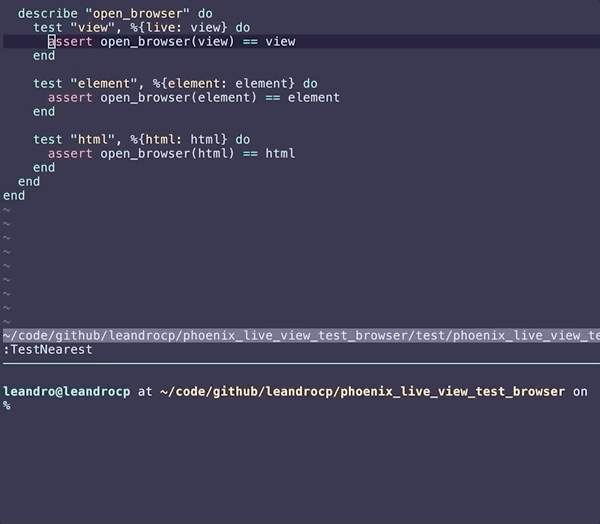

# PhoenixLiveViewTestBrowser

Tiny utility to inspect LiveView's views and html on your tests. Just call `open_browser/1` passing a view, element, or html string to render the current template on your default browser.

Current status: PoC

## Usage

```elixir
import PhoenixLiveViewTestBrowser

# inspect current view
open_browser(view)

# or an element
view |> element("div") |> open_browser()

# or call it to help you to debug that complex assert
assert view
       |> form("form[phx-submit=save]")
       |> render_submit(%{"user" => %{"id" => ""}})
       |> open_browser() =~ "Please select an user"

```



### CSS

Element rendering is limited to its own template, which means it doesn't include the whole layout, including the stylesheets. But this library will detect that and include the proper `html`, `head`, and `body` elements, along with the "priv/static/css/app.css" stylesheet.

## Installation

If [available in Hex](https://hex.pm/docs/publish), the package can be installed
by adding `phoenix_live_view_test_browser` to your list of dependencies in `mix.exs`:

```elixir
def deps do
  [
    {:phoenix_live_view_test_browser, "~> 0.1.0"}
  ]
end
```

Documentation can be generated with [ExDoc](https://github.com/elixir-lang/ex_doc)
and published on [HexDocs](https://hexdocs.pm). Once published, the docs can
be found at [https://hexdocs.pm/phoenix_live_view_test_browser](https://hexdocs.pm/phoenix_live_view_test_browser).

